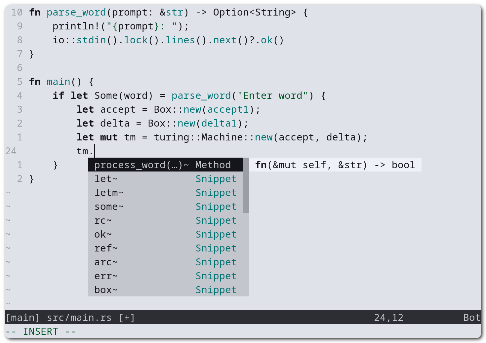

# Neovim Config
<a href="https://neovim.io/" width="50px" align="right">
  
</a>

Simple Neovim Config


<details>
  <summary>Preview</summary>
    <div align="center">
      <picture>
        <source media="(prefers-color-scheme: dark)" srcset="./assets/screenshot-dark.png" width="780px" alt="screenshot"/>
        
      </picture>
    </div>
</details>

## :clipboard: Requirements
- Neovim >= 0.10
- Linux or macOS

## :package: Installation
Clone the repository into the config directory.
```sh
git clone "https://github.com/notfirefox/nvim-config.git" ~/.config/nvim
```

###### macOS
```sh
brew install fd fzf neovim ripgrep tree-sitter
```

###### Ubuntu
```sh
sudo apt install fd-find fzf neovim ripgrep tree-sitter-cli
```
